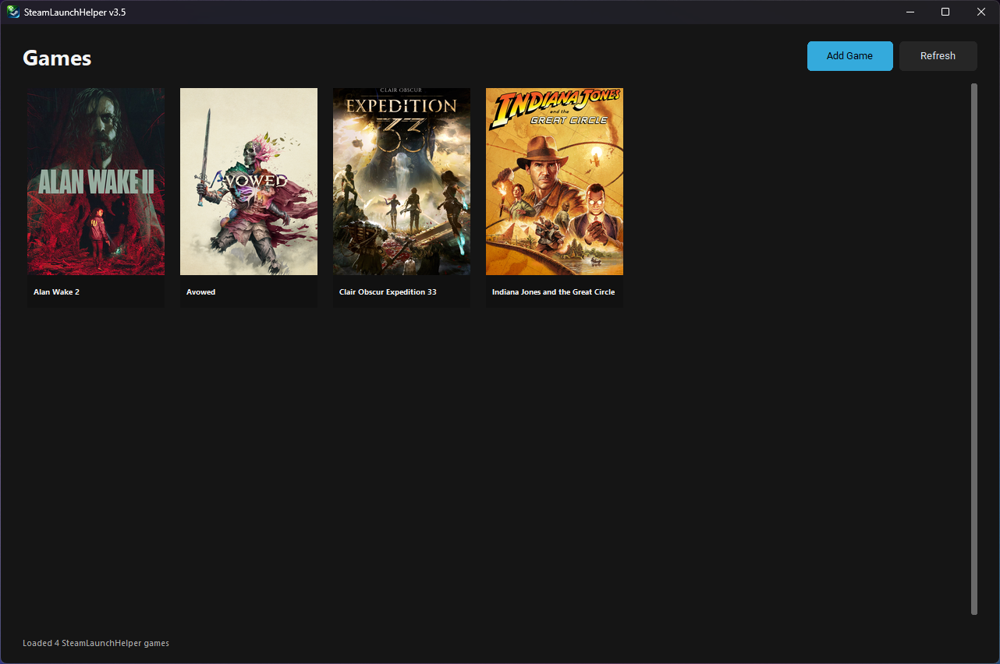
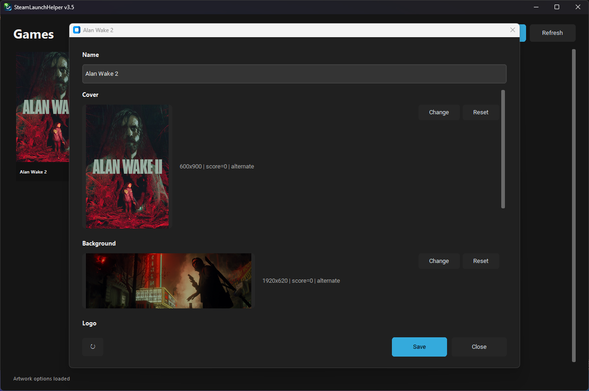
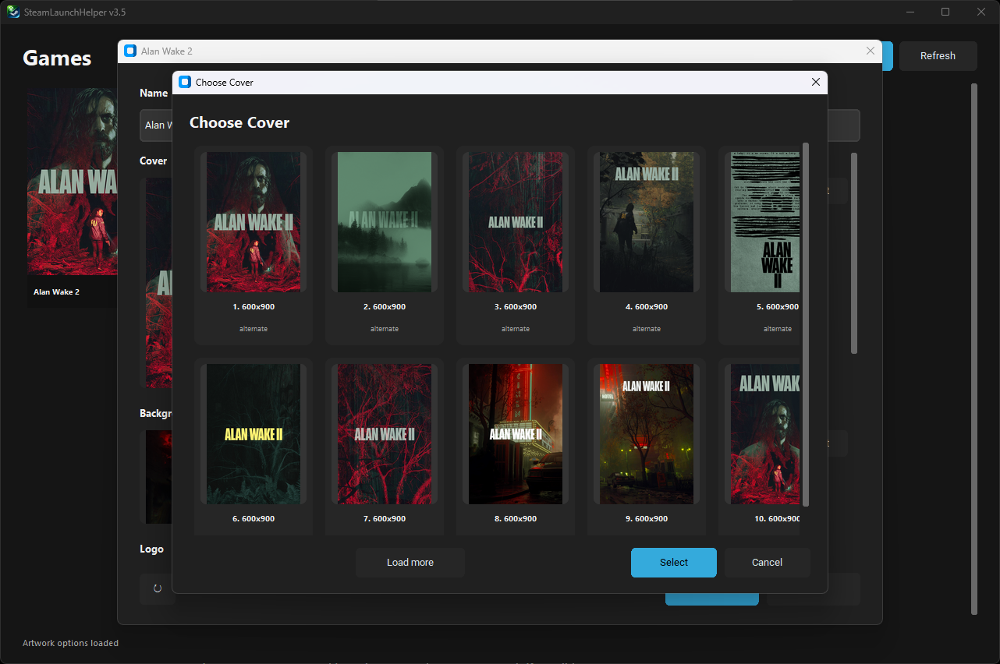

# SteamLaunchHelper

Launch non-Steam games reliably through Steam Big Picture Mode.

SteamLaunchHelper is a Windows utility that automatically creates and manages Steam-compatible launchers for non-Steam games, especially Xbox/Game Pass and Epic Games Store titles.

It solves common Steam session tracking issues where Steam loses focus or fails to recognize non-Steam games properly in Big Picture Mode.

---

## Features

- Automatic Xbox Game Pass game detection
- Automatic Epic Games Store game detection
- Steam shortcut creation
- Reliable Steam session tracking
- SteamGridDB artwork integration
- Modern Steam-style artwork customization UI
- Automatic artwork application
- Dedicated launcher runtime architecture
- Xbox/Game Pass compatibility fixes
- Epic Games Store URI launching support

---

## Screenshots

### Main Window



---

### Game Customization



---

### Artwork Picker



---

## Requirements

- Windows 10 / 11
- Steam
- Python 3.10+ (for source usage)

---

## Included Runtime

SteamLaunchHelper ships with a prebuilt launcher runtime:

```text
launcher/launcher.exe
```

This launcher is automatically copied into each game folder and handles:

- launching the game
- process tracking
- Steam session persistence
- automatic exit handling

---

## Repository

GitHub:
https://github.com/smaneesint/steamlaunchhelper